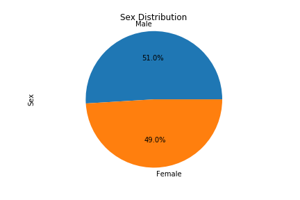

# DataVis-challenge
Week 5 homework

## Background
The project is to assist a a new pharmaceutical company that specializes in anti-cancer medications in analyzing their most recent animal study. In this study, 249 mice who were identified with SCC tumors received treatment with a range of drug regimens. Over the course of 45 days, tumor development was observed and measured. The purpose of this study was to compare the performance of Pymaceuticals’ drug of interest, Capomulin, against the other treatment regimens.

The task is to generate all of the tables and figures needed for the technical report of the clinical study and to provide a top-level summary of the study results.

## Findings

* Both Capomulin and Ramicane show a lower mean and median tumor volume as compared to the other drug regimens.

 

* The data included more timepoints for both Capomulin and Ramicane.

* The distribution of female versus male mice is close to equal at 49% and 51%.

* The Capumulin and Ramicane regimens are showing to result in a smaller final tumor volume.

* When viewing a line chart of a mouse on Capomulin, we can see the drop in tumor volume over time. It'd be interesting to have additional timepoints here to see more of the trendline.

* The average tumor volume increases with higher mouse weight.

* The correlation between mouse weight and average tumor volume is 0.84. This is a high correlation and shows that increased mouse weight increases the average tumor volume.
* The regression analysis shows that the average tumor volume changes with different mouse wight. The R-squared value of 0.70 shows that 70% the model fit the data.
